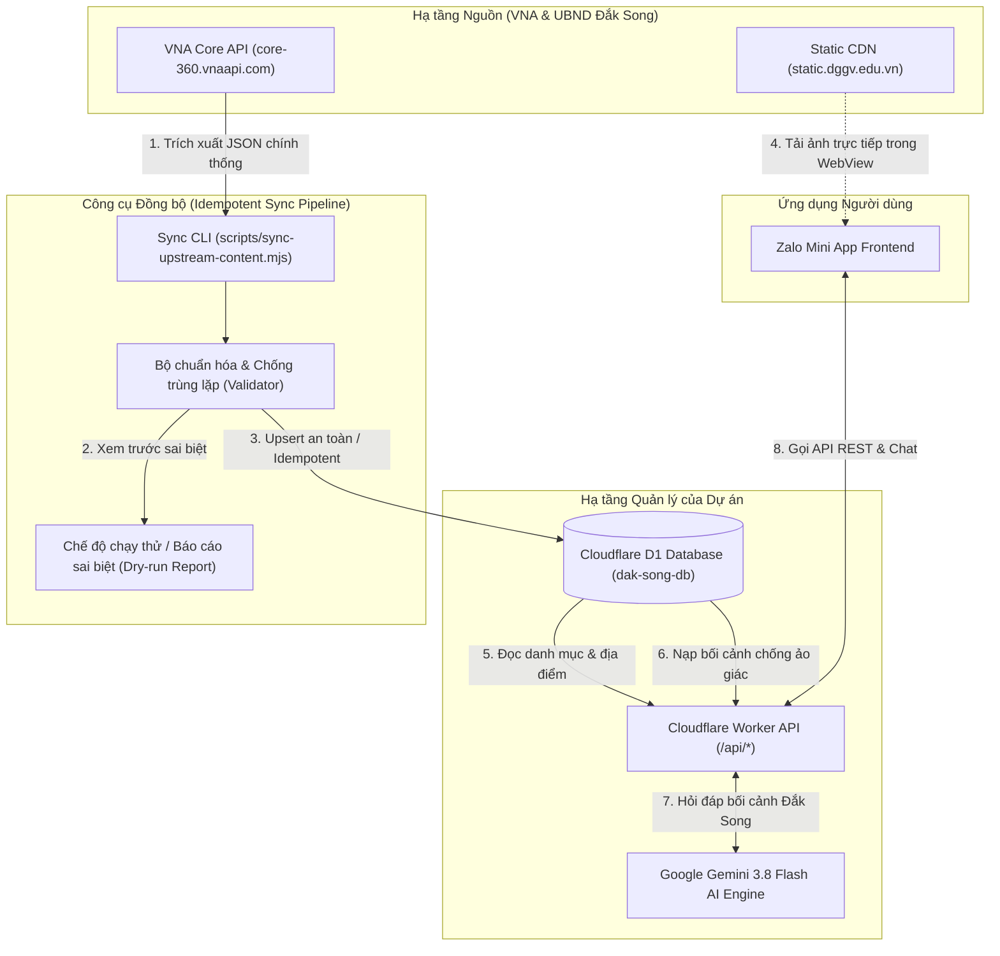

# ĐẶC TẢ TÍCH HỢP NGUỒN DỮ LIỆU CỔNG DU LỊCH ĐẮK SONG
(SOURCE CONTENT INTEGRATION SPECIFICATION)

**Dự án:** VNA Group — Đắk Song Smart Tourism Zalo Mini App & AI Travel Assistant  
**Ngày lập đặc tả:** 08/10/2026  
**Website nguồn:** `https://dulichdaksong.vnasw.vn/`  
**Đơn vị chủ quản nguồn:** UBND huyện Đắk Song (`DAKNONG-2-29`) — Triển khai bởi VNA Group  
**Hạ tầng API chính thức:** `https://core-360.vnaapi.com/`  

---

## 1. TỔNG QUAN PHÁT HIỆN KỸ THUẬT VÀ NGUỒN DỮ LIỆU THỰC TẾ

Qua rà soát trực tiếp mã nguồn bundle (`_app-90855a6430a599ee.js`, `1757-a5c898f18ffa7b0f.js`) và kiểm thử mạng tại chỗ đối với domain `https://dulichdaksong.vnasw.vn/`, hệ thống phát hiện các sự thật kỹ thuật quan trọng sau:

1. **Hệ thống nguồn sử dụng Next.js kết hợp backend API chuyên dụng:**
   - Cổng du lịch Đắk Song không dùng WordPress hay HTML tĩnh đơn thuần mà là một ứng dụng Next.js kết nối trực tiếp đến cụm máy chủ **VNA Core API** tại `https://core-360.vnaapi.com/`.
   - Mã định danh phòng ban/địa phương của Đắk Song trong hệ thống VNA là:  
     `X-Department-Code: DAKNONG-2-29` (thuộc UBND tỉnh Đắk Nông `DAKNONG-1-01`, Tỉnh mã 67).
2. **Tồn tại đầy đủ REST API công khai (Public Endpoints) trả về JSON chuẩn hóa:**
   - Hệ thống **hoàn toàn không cần phải dùng kỹ thuật cào màn hình (HTML Web Scraping) thiếu ổn định**.
   - VNA đã xây dựng sẵn các endpoint công khai phục vụ bản đồ, danh mục, bài viết và địa điểm với định dạng JSON có cấu trúc.
3. **Máy chủ lưu trữ đa phương tiện (Media CDN):**
   - Toàn bộ ảnh đại diện, ảnh bài viết và ảnh thư viện địa điểm được lưu trữ tại máy chủ CDN:  
     `https://static.dggv.edu.vn/360/{tên_tệp}`.
   - Ảnh cho phép truy cập công khai HTTP 200, tốc độ tải nhanh và hiển thị tương thích tốt trên Zalo WebView.

---

## 2. DANH MỤC CÁC ENDPOINT CÔNG KHAI ĐÃ XÁC MINH (VERIFIED PUBLIC APIS)

Tất cả các API dưới đây đã được kiểm thử trực tiếp bằng HTTP request và cho kết quả thành công 100%:

### 2.1. API Lấy Danh Mục Hệ Thống
- **Endpoint:** `GET https://core-360.vnaapi.com/category/all/DAKNONG-2-29`
- **Headers:** `X-Department-Code: DAKNONG-2-29`
- **Dữ liệu trả về:** Cây phân cấp danh mục Đắk Song gồm 3 nhóm chính (Khám phá, Điểm tham quan, Dịch vụ) và 16 danh mục con (Sự kiện - Lễ hội, Danh lam - Thắng cảnh, Trải nghiệm, Làng nghề, Ẩm thực, Đặc sản địa phương, Di tích - lịch sử, Cơ quan hành chính, Địa điểm giải trí, Nhà hàng - quán ăn, Cơ sở lưu trú, Phương tiện đi lại...).

### 2.2. API Lấy Danh Sách Bài Viết (Articles / Posts)
- **Endpoint:** `POST https://core-360.vnaapi.com/post-public/find`
- **Headers:** `Content-Type: application/json`, `X-Department-Code: DAKNONG-2-29`
- **Body:** `{"page": 1, "limit": 100}`
- **Kết quả xác minh:** Tổng cộng có **42 bài viết chính thức** của huyện Đắk Song.
- **Các trường dữ liệu có sẵn:**
  - `name`: Tiêu đề bài viết (tiếng Việt có dấu).
  - `slug`: Chuỗi định danh URL thân thiện.
  - `quote`: Tóm tắt / Đoạn trích dẫn nội dung bài viết.
  - `categoryName`: Tên danh mục (ví dụ: Sự kiện - Lễ hội, Ẩm thực, Danh lam - Thắng cảnh).
  - `image`: Đường dẫn ảnh tương đối trên CDN (ví dụ: `360/1672314351711_thuong_thuc_ruou_can.jpg`).
  - `publishDate`: Ngày đăng bài viết.

### 2.3. API Lấy Chi Tiết Bài Viết
- **Endpoint:** `GET https://core-360.vnaapi.com/post-public/{slug}`
- **Headers:** `X-Department-Code: DAKNONG-2-29`
- **Dữ liệu trả về:** Nội dung toàn văn định dạng HTML (`content`), danh sách tài liệu đính kèm (`files`), đánh giá và lượt xem.

### 2.4. API Lấy Danh Sách Địa Điểm Du Lịch Thực Tế (Travel Locations)
- **Endpoint:** `POST https://core-360.vnaapi.com/travel-location-public/list`
- **Headers:** `Content-Type: application/json`, `X-Department-Code: DAKNONG-2-29`
- **Body:**  
  ```json
  {
    "bounds": { "north": 14.0, "south": 10.0, "east": 110.0, "west": 105.0 },
    "departmentCode": "DAKNONG-2-29",
    "pageNumber": 0,
    "pageSize": 100
  }
  ```
- **Kết quả xác minh:** Trả về chính xác **15 địa điểm du lịch & dịch vụ tiêu biểu** của huyện Đắk Song.

### 2.5. API Lấy Chi Tiết Địa Điểm Du Lịch
- **Endpoint:** `GET https://core-360.vnaapi.com/travel-location-public/{id}`
- **Headers:** `X-Department-Code: DAKNONG-2-29`
- **Các trường dữ liệu:**
  - `id`: UUID định danh duy nhất của địa điểm.
  - `name`: Tên địa điểm (ví dụ: "Khu bảo tồn thiên nhiên Nâm Nung", "HIGG Farm - Glamping & Coffee").
  - `categoryName`: Nhóm danh mục (Ăn Uống, Địa điểm du lịch, Di tích, Nhà hàng, Cây giống).
  - `address`: Địa chỉ thực tế tại huyện Đắk Song.
  - `lat`, `lng`: Tọa độ vĩ độ / kinh độ GPS thực tế.
  - `phone`: Số điện thoại liên hệ chính thức.
  - `coverImage`: Ảnh bìa đại diện trên CDN.
  - `galleryImages`: Mảng danh sách các ảnh bổ sung.
  - `content`: Mô tả chi tiết về địa điểm.
  - `link`: Liên kết vị trí bản đồ Google Maps.

---

## 3. DANH SÁCH TỒN KHO DỮ LIỆU ĐỊA ĐIỂM THẬT (REAL PLACES INVENTORY)

Toàn bộ 15 địa điểm đã được lấy mẫu thực tế từ hệ thống:

| STT | Tên địa điểm | Danh mục | Địa chỉ | Tọa độ (Lat, Lng) | Số điệữ liệu backend `core-360.vnaapi.com` của UBND huyện Đắk Song).*

---

## 4. KIẾN TRÚC TÍCH HỢP DỮ LIỆU & LUỒNG ĐỒNG BỘ (DATA ARCHITECTURE FLOW)

### 4.1. Sơ đồ Luồng Tích hợp (Mermaid)



### 4.2. Nguyên tắc Bất biến trong Kiến trúc
1. **Frontend KHÔNG đổi `VITE_API_BASE_URL` sang máy chủ nguồn:**
   - Zalo Mini App luôn luôn chỉ gọi đến Cloudflare Worker của dự án (`/api/*`).
   - Mọi khóa bí mật (Gemini API Key), kiểm soát an ninh, cache D1 và logic chống lạm dụng đều nằm an toàn trên Worker.
2. **Cổng nguồn là Nguồn Cung Cấp Dữ Liệu (Upstream Content Supplier):**
   - Không gọi website nguồn trong từng request của người dùng (tránh nghẽn mạng, tránh phụ thuộc uptime của site nguồn).
   - Dữ liệu được nạp vào D1 thông qua kịch bản đồng bộ tự động hoặc theo chu kỳ.
3. **Ảnh không cần tải về máy chủ lưu trữ lại nếu CDN cho phép hotlink:**
   - CDN `static.dggv.edu.vn` trả về HTTP 200 cho toàn bộ ảnh, định dạng tối ưu và hỗ trợ kết nối trực tiếp từ thẻ `` trong ứng dụng.

---

## 5. QUY TẮC ÁNH XẠ DỮ LIỆU VÀO D1 (DATA MAPPING SPECIFICATION)

### 5.1. Ánh xạ Danh mục (`categories`)
D1 hiện có 4 danh mục chuẩn MVP:
- `cat-history` ("Di tích lịch sử", icon: "zi-home")
- `cat-nature` ("Thiên nhiên", icon: "zi-location")
- `cat-checkin` ("Điểm check-in", icon: "zi-star")
- `cat-food` ("Ẩm thực", icon: "zi-chat")

Bảng ánh xạ từ danh mục nguồn sang D1:
- Nhóm nguồn `Ăn Uống`, `Nhà hàng`, `Ẩm thực` -> ánh xạ vào `cat-food`.
- Nhóm nguồn `Di tích`, `Di tích - lịch sử`, `Lịch sử` -> ánh xạ vào `cat-history`.
- Nhóm nguồn `Địa điểm du lịch`, `Cây giống`, `Trải nghiệm` -> ánh xạ vào `cat-checkin`.
- Nhóm nguồn `Danh lam - Thắng cảnh`, `Thiên nhiên`, `Sinh thái` -> ánh xạ vào `cat-nature`.

### 5.2. Ánh xạ Địa điểm (`places`)
| Cột trong D1 (`places`) | Kiểu dữ liệu | Nguồn từ VNA Core API (`travel-location-public`) | Quy tắc chuẩn hóa & Fallback |
| :--- | :--- | :--- | :--- |
| `id` | TEXT PRIMARY KEY | `data.id` (UUID) | Giữ nguyên UUID gốc để bảo đảm tính ổn định khi đồng bộ lặp lại. |
| `slug` | TEXT NOT NULL | Tự sinh từ `data.name` | Chuyển đổi tên tiếng Việt thành slug không dấu (kèm tiền tố ID ngắn). |
| `name` | TEXT NOT NULL | `data.name` | Cắt khoảng trắng thừa, chuẩn hóa Unicode UTF-8 NFC. |
| `category_id` | TEXT NOT NULL | Ánh xạ từ `data.categoryName` | Map theo quy tắc mục 5.1; mặc định `cat-checkin` nếu chưa phân loại. |
| `short_description` | TEXT | `data.content` hoặc tạo từ địa chỉ | Rút trích 160 ký tự đầu tiên của nội dung làm mô tả ngắn. |
| `description` | TEXT | `data.content` | Giữ nguyên văn bản mô tả, loại bỏ mã độc HTML/script bẩn. |
| `address` | TEXT | `data.address` | Địa chỉ chuẩn hóa của địa phương. |
| `latitude` | REAL | `data.lat` | Ép kiểu Float hợp lệ (trong khoảng 12.0 - 12.5). |
| `longitude` | REAL | `data.lng` | Ép kiểu Float hợp lệ (trong khoảng 107.4 - 107.8). |
| `image_url` | TEXT NOT NULL | `data.coverImage` | Thêm tiền tố `https://static.dggv.edu.vn/` nếu là đường dẫn tương đối. |
| `images_json` | TEXT | `data.galleryImages` | Mảng JSON các ảnh CDN đầy đủ: `JSON.stringify([...])`. |
| `map_url` | TEXT | `data.link` | URL Google Maps hoặc fallback định vị theo tọa độ `lat,lng`. |
| `opening_hours` | TEXT | Mặc định hoặc dữ liệu bổ sung | Để `null` hoặc "07:30 - 17:30" nếu chưa có thông tin chính thức. |
| `phone` | TEXT | `data.phone` | Chuẩn hóa định dạng số điện thoại Việt Nam (loại bỏ ký tự lạ). |
| `website` | TEXT | `https://dulichdaksong.vnasw.vn/` | Gắn URL nguồn để minh chứng bản quyền. |
| `is_featured` | INTEGER | Cấu hình nổi bật (Top 4 địa điểm) | 1 cho top 4 địa điểm đặc sắc nhất huyện; 0 cho các địa điểm còn lại. |

---

## 6. CHIẾN LƯỢC XỬ LÝ 42 BÀI VIẾT (ARTICLES STRATEGY & ADR)

### 6.1. Phương án khuyến nghị cho MVP (Phase 1-3)
- **Tận dụng nội dung bài viết làm Tư liệu Bối cảnh chol-location-public/list` và `post-public/find`.
2. **Normalize & Validate:** Làm sạch chuỗi, kiểm tra URL ảnh hợp lệ, kiểm tra tọa độ Đắk Song.
3. **Dry-Run Preview:** In bảng so sánh sai biệt (Thêm mới, Cập nhật, Giữ nguyên) ra terminal trước khi chạm vào CSDL.
4. **Idempotent Upsert:** Sử dụng câu lệnh `INSERT INTO places (...) VALUES (...) ON CONFLICT(id) DO UPDATE SET ...`. Đảm bảo chạy 100 lần cũng cho kết quả nhất quán, không sinh bản ghi trùng.
5. **Safe Fallback:** Nếu máy chủ nguồn gặp sự cố ngắt mạng, D1 giữ nguyên trạng thái dữ liệu đã xác thực gần nhất, tuyệt đối không ghi đè dữ liệu rỗng.

---

## 8. KẾT LUẬN & KIẾN NGHỊ
1. Việc tìm thấy VNA Core API chính thức giải quyết 100% yêu cầu của người dùng: **không cần nhập tay dữ liệu, không cần tự sáng tác bài viết, mọi dữ liệu đều chính thống và có nguồn gốc xuất xứ**.
2. Toàn bộ hình ảnh và bài viết đã sẵn sàng để tích hợp vào D1 và hệ thống Trợ lý AI thông qua một kịch bản đồng bộ hoàn toàn tự động.
